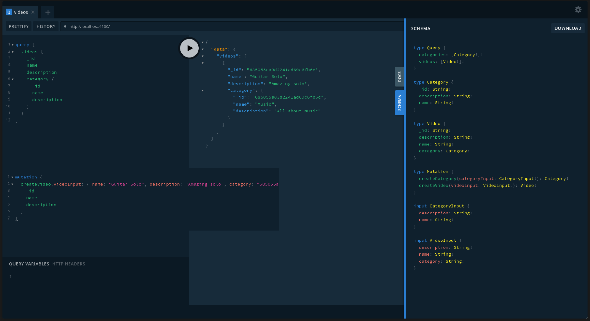

<h1 align="center"> Streaming API </h1>

<p align="center">
  
  
  
  
  
  
  
</p>

<p align="center">
  <a href="#-technologies">Technologies</a>&nbsp;&nbsp;&nbsp;|&nbsp;&nbsp;&nbsp;
  <a href="#-project">Project</a>&nbsp;&nbsp;&nbsp;|&nbsp;&nbsp;&nbsp;
  <a href="#-layout">Layout</a>&nbsp;&nbsp;&nbsp;|&nbsp;&nbsp;&nbsp;
  <a href="#-license">License</a>
</p>

<p align="center">
  
</p>

<br>

<p align="center">
  
</p>

## 🚀 Technologies

This project was developed with the following technologies:

- TypeScript
- Node.js
- GraphQL
- TypeGraphQL
- Apollo Server
- Mongoose
- reflect-metadata
- ts-node-dev
- Prettier
- Git e Github

## 💻 Project

This repository hosts an application that simulates a streaming platform, allowing users to view a list of videos and its categories. The project is built using Node.js and TypeGraphQL, and it features endpoints that provides a list of resources, along with their details.

## 💻 How to run

```bash
# Clone the repository
git clone https://github.com/filipebteixeira98/streaming-api.git

# Access the project folder
cd streaming-api

# Install the dependencies
yarn
# or
yarn install

# Run the project
yarn dev
# The Apollo Server (Playground) will be running on http://localhost:4100
```

## 📝 License

This project is under the MIT license.

<p align="center">
  Made with ♥ by me
</p>
